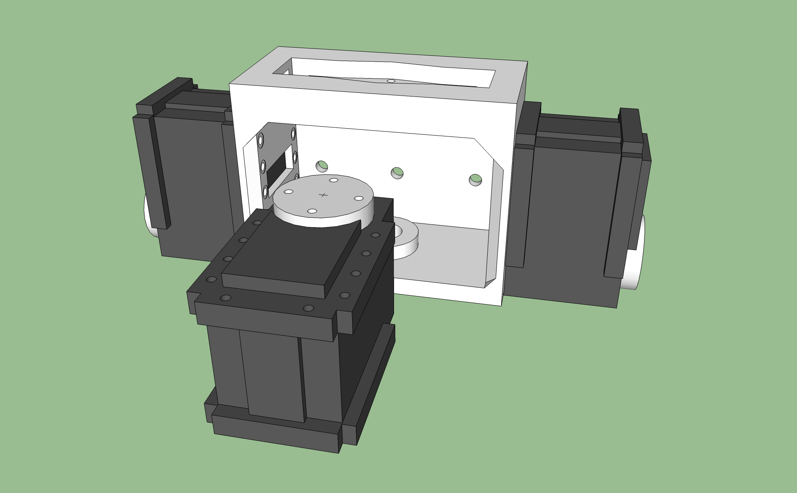
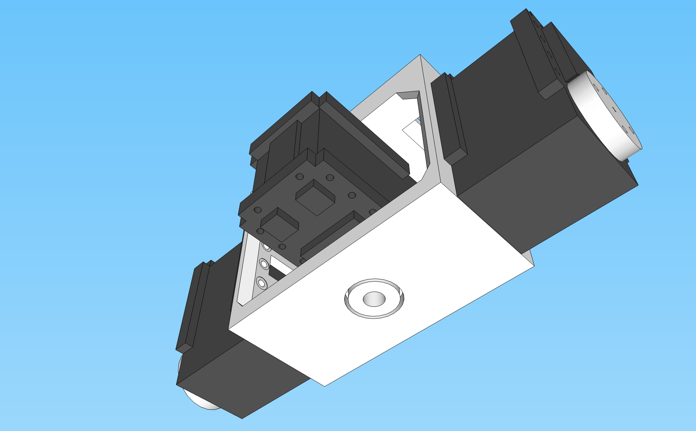
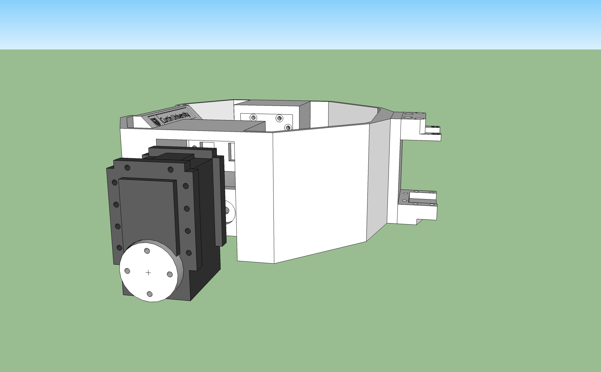
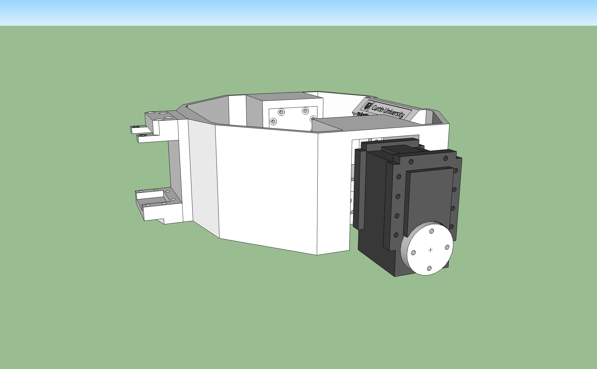
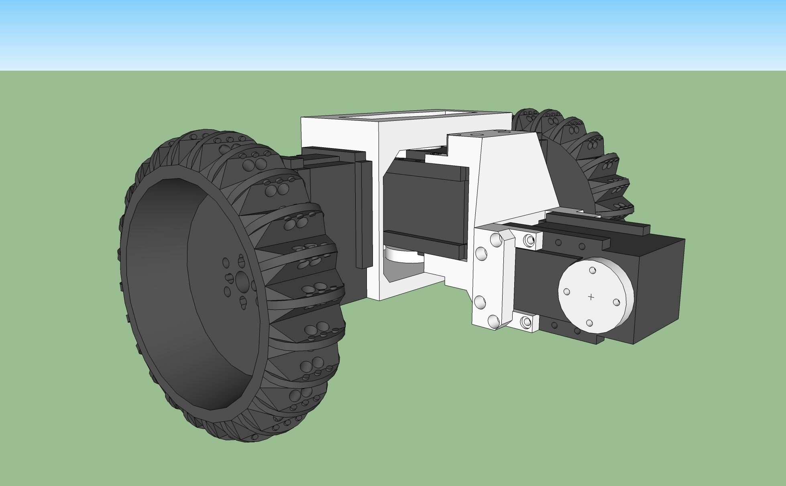
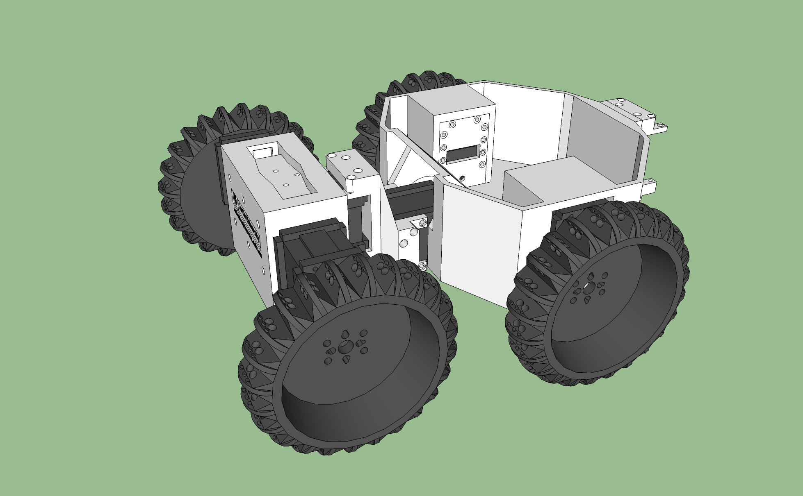
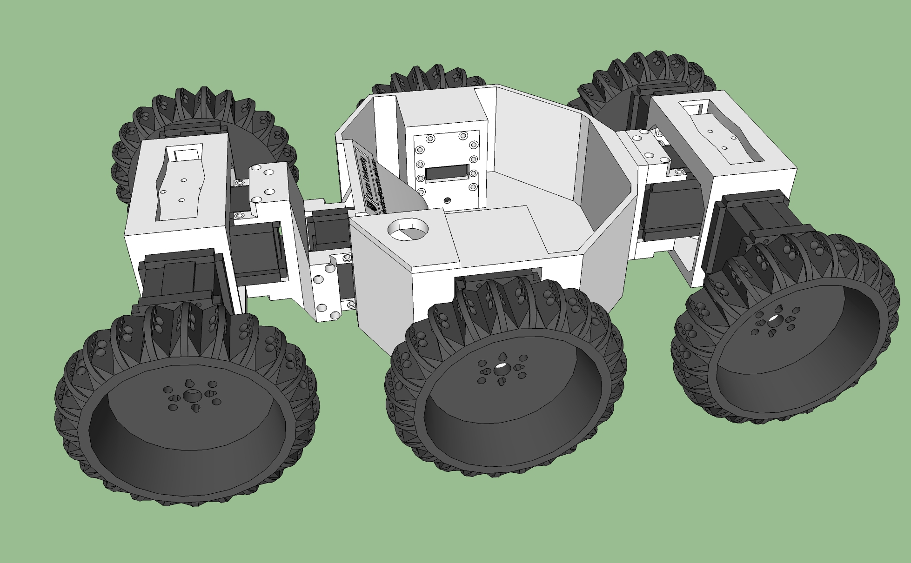

# Functional Spec

The following is just a mock up of the documentation for the construction of the six-wheeled wonder. Currently, we believe that a large part of this project is lowering the barrier of entry to robotics, so documentation is a large part of that. We hope that this will serve as a "Functional Spec", something that will give guidance on how the system should appear to the end user.

A paper prototype of sorts.

As a result, this functional spec is by no means complete. It will be changed over time.

# Introduction

Getting involved with robotics is a difficult, but a rewarding experience. (TBD)

## Parts needed

To construct the sex-wheeled wonder, you will need a 3D printer, and a number of other parts.

* 9 x Dynapixel AX-12A smart servos.
* 36 x M2 x 10mm bolts
* 48 x M2 x 15mm bolts
* 48 x M2 nuts
* 3 x M3 x 15mm bolts

The 3D printed parts are available on the OARK site, and there are five different types to be printed:

* 6 x Wheel, it is the six-wheeled wonder after all.
* 2 x End body segment.
* 1 x Main body.
* 1 x Estop button mounting.
* 1 x Suspension arm.
* 2 x Bushes.

# Assembly

## End Segments

Starting with an end body segment, attach two AX-12As to either end as shown:

Both of these end servos have the drive wheel at the bottom, the wheels will be attaching directly to these. The third servo goes in mounted with the drive wheel facing up. One of the bushes is inserted into the hole underneath, and a bolt is used to secure it directly to the servo.

Attach the wheels onto the servos, and the result should be the following:

Assemble the remaining end segment the same way, so you have two identical setups.

## Main Body

With the main body, two servos need to be mounted as shown:

## Actuated suspension

The remaining assembly is to mount a single servo on the suspension bracket as shown.
((The picture currently shows two servos, however this will be updated so that only one is shown))

This servo is mounted with drive wheel sideways, this is the servo that will eventually be mounted to the main body.

The suspension arm is then mounted to one of end segment assemblies.

This end segment with suspension arm is mounted to the main body.

Finally the remaining end segment is mounted to the main body.

## Wiring and mounting of controller board

((TBD, also, it might be easier if some of the wiring was done while assembling))

Things to consider:

* Raspberry Pi used, mounting and easy access to serial port, USB ports, SD card slot, anything else that may need to be added.

## Installing the OARK software

((From the software project point of view, this is a small user case example.))

The OARK features software for the Raspberry Pi, this software is what acts between the robots hardware and the user, providing an easy to understand interface for controlling the robot and for modifying its design. To begin, the image needs to be installed onto a SD card, and this card is inserted into the Raspberry Pi.
